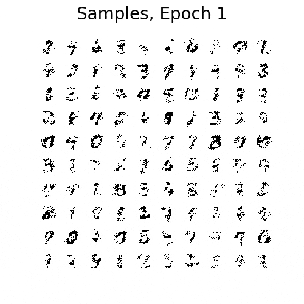
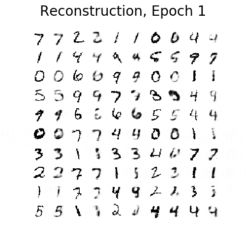
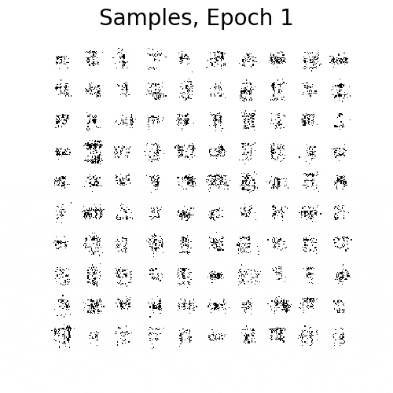
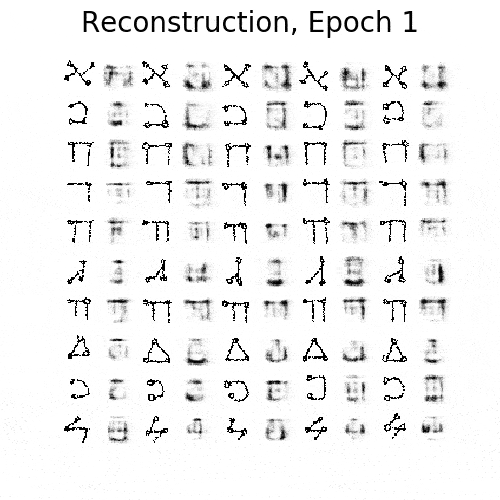

# pytorch-vae

A minimal pytorch implementation of [VAE](https://arxiv.org/abs/1312.6114), [IWAE](https://arxiv.org/abs/1509.00519), and [MIWAE](https://arxiv.org/abs/1802.04537).
We followed the experimental details of the [IWAE paper](https://arxiv.org/abs/1509.00519).
<br><br>


## Usage

You should be able to run experiments right away.
First create a virtual environment using [pipenv](https://github.com/pypa/pipenv):

```pipenv install```

To run experiments, you simply have to use:

```pipenv run python main.py <options>```
<br><br>


## Example commands

For original VAE:

```pipenv run python main.py ```

To also make figures (reconstruction, samples):

```pipenv run python main.py --figs ```

For IWAE with 5 importance samples:

```pipenv run python main.py --importance_num=5 ```

For MIWAE(16, 4):

```pipenv run python main.py --mean_num=16 --importance_num=4 ```

See [the config file](https://github.com/yoonholee/pytorch-generative/blob/master/utils/config.py) for more options.
<br><br>


## Results



### Quantitative results on dynamically binarized MNIST
| Method  | NLL (this repo) | NLL ([IWAE paper](https://arxiv.org/abs/1509.00519)) | NLL ([MIWAE paper](https://arxiv.org/abs/1802.04537)) | comments |
| ------------- | ------------- | ------------- | ------------- | ---- |
| VAE | 87.01 | 86.76 | - |
| MIWAE(5, 1) | 86.45 | 86.47 | - | listed as VAE with k=5
| MIWAE(1, 5) | 85.18 | 85.54 | - | listed as IWAE with k=5
| MIWAE(64, 1) | 86.07 | - | 86.21 | listed as VAE
| MIWAE(16, 4) | 84.99 | - | - |
| MIWAE(8, 8) | 84.69 | - | 84.97 |
| MIWAE(4, 16) | 84.52 | - | 84.56 |
| MIWAE(1, 64) | 84.37 | - | 84.52 | listed as IWAE
